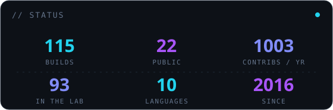
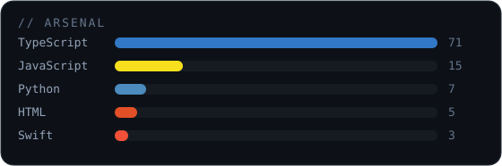
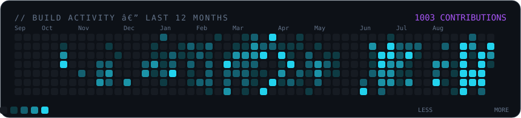
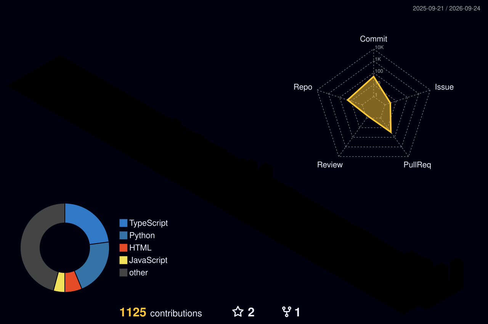

<div align="center">




[](https://github.com/nandanosql)
[](https://github.com/nandanosql?tab=followers)
[](https://www.linkedin.com/in/nandan-priyadarshi/)
[](https://x.com/nandanpri)
[](https://www.nandanpriyadarshi.com)

</div>


## // WHOAMI

```txt
10+ years turning data into products. Now turning products into AI tools.
Senior Product Manager @ Xiaomi · Builder of things that make PMs & devs faster.
```

-  I ship **AI developer & PM tools** — MCP servers, agent skills, full products
- 🛰️ Background: B2B SaaS · Customer Data Platforms · Data Infrastructure · International markets (India · China · SEA)
- 🤖 Secret weapon: a squad of AI agents (planner · builder · critic · QA) — ask me how
- 🎯 Current mission: turn **115 repos into 3 products with 10,000 real users**


## // FEATURED BUILDS

| Project | What it does | Stack |
|---|---|---|
| [**database-explorer-mcp**](https://github.com/nandanosql/database-explorer-mcp) | Talk to PostgreSQL / MySQL / SQLite / MongoDB in plain English — MCP server for AI agents | `TypeScript` `MCP` |
| [**unidevbox-vscode**](https://github.com/nandanosql/unidevbox-vscode) | 20+ dev utilities inside VS Code — JSON, regex, UUID, hashes, no context switching | `TypeScript` `VS Code` |
| [**ai-slides**](https://github.com/nandanosql/ai-slides) | Describe a deck in plain text → get a polished HTML presentation | `Claude Skill` `HTML` |
| [**all_in_one_pm_skills**](https://github.com/nandanosql/all_in_one_pm_skills) | 103 battle-tested PM skills for the AI-first era | `Agent Skills` |
| [**prd_generator_skill**](https://github.com/nandanosql/prd_generator_skill) | Feishu BRD in → developer-ready PRD out | `Claude Skill` |
| [**data_analyst_pro**](https://github.com/nandanosql/data_analyst_pro) | Automated EDA + natural-language queries over CSV, Excel & SQL | `Python` |
| [**mimohub**](https://github.com/nandanosql/mimohub) | Chat with your Excel sheets using Xiaomi MiMo AI | `Python` `Streamlit` |


## // TELEMETRY

<div align="center">








</div>


## // STACK

<div align="center">


</div>


## // CONTRIBUTION SNAKE

<div align="center">


</div>


## // TRANSMISSION

<div align="center">

**Open to:** AI tool collaborations · product strategy consulting · speaking

[LinkedIn](https://www.linkedin.com/in/nandan-priyadarshi/) · [X / Twitter](https://x.com/nandanpri) · [Website](https://www.nandanpriyadarshi.com)

<br/>

*"The best way to predict the future is to build it."*

</div>